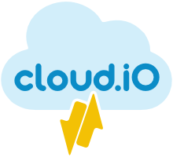

# Introduction

**Cloud.iO** is a scalable **open source** Internet of Things solution licensed under the **MIT license**. It offers an infrastructure to **monitor** and
**control** a huge number of I/O devices from a central cloud platform. cloud.iO can provide both, **real-time** monitoring and control data and **historic**
data storage in a single place. Using state of the art **encryption** and certificate-based **authentication** for all connections (embedded Device Endpoints
and applications accessing the actual data) and offering **flexible access control** mechanisms, cloud.iO is the ideal platform in order to drive your data
acquisition projects on one single platform. It’s **scalable** architecture allows it to grow with your needs.  

   
   
  
   
   

- [Introduction](introduction)
- About cloud.iO	
	- [The cloud.iO ecosystem](/about_cloudio/ecosystem#the-cloudio-ecosystem)
	- [The data structure](/about_cloudio/data_structure#the-data-structure)
	- [The architecture](/about_cloudio/architecture#the-architecture)
- Getting Started
	- [Quickstart guide](/getting_started/quickstart_guide "The greatest guide in the world")
	- [Deploy cloud hosted infrastructure](/deploy/deploy)
	- [Develop a cloud.iO endpoint](/develop_endpoint/develop_endpoint)
	- [Commission a cloud.iO endpoint](/commission/commission)
	- [Manage endpoint access permissions](/manage_access/manage_access)
	- [Monitor and control data](monitor_control/monitor_control)
- Contribute
	- [Contribute](contribute/contribute)